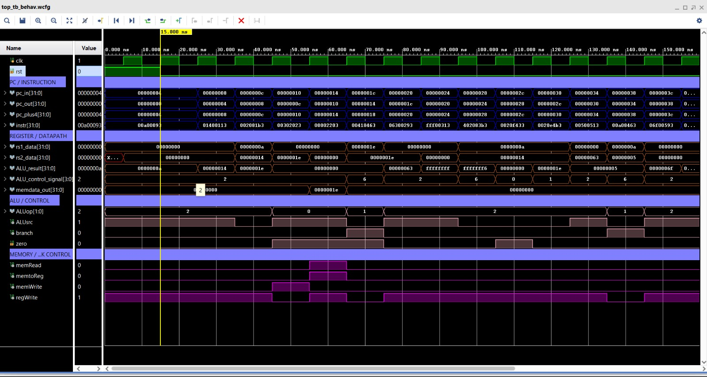
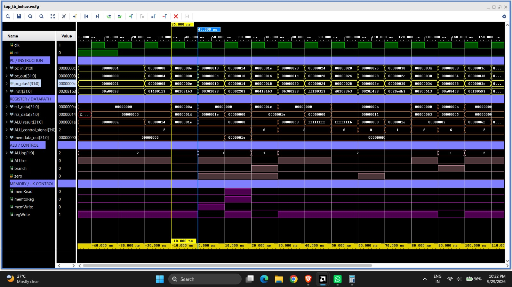
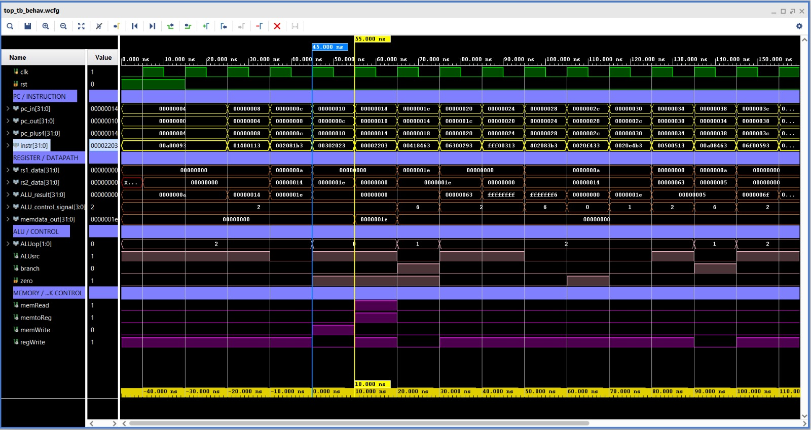
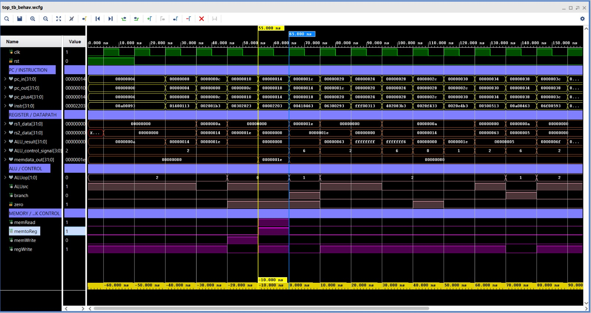
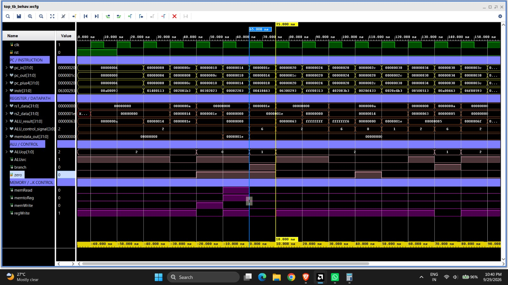
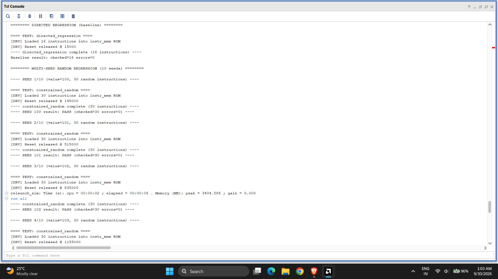
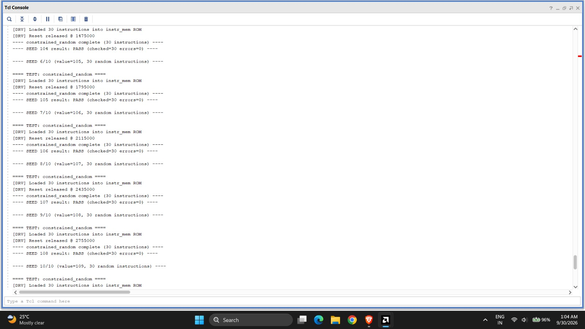
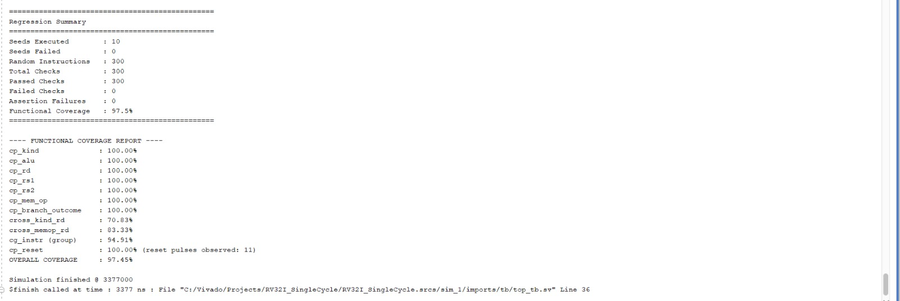

# RV32I Single-Cycle RISC-V Core
### SystemVerilog Constrained-Random Verification with Scoreboard and SVA

A 32-bit single-cycle RISC-V processor verified using a complete SystemVerilog class-based constrained-random testbench.

## 1. Project Overview

This project focuses on the functional verification of a 32-bit single-cycle RISC-V processor implementing the RV32I base integer instruction set. RV32I is the foundational 32-bit integer ISA for RISC-V. The primary focus of this project is the construction of a robust, automated verification environment to validate the processor's correctness, rather than modifying the CPU RTL itself.

**Key Features**
* 32-bit single-cycle RV32I processor
* SystemVerilog class-based verification environment
* Constrained-random instruction generation
* Directed instruction testing
* Complete Generator → Driver → DUT → Monitor → Scoreboard flow
* Automated scoreboard checking 
* SystemVerilog Assertions (SVA) for temporal/state validation
* Multi-seed regression (10 seeds × 30 instructions)
* Functional coverage collection
* Vivado XSim simulation

## 2. RV32I Processor Overview

**What is RV32I?**
RV32I is the base 32-bit integer instruction set architecture of RISC-V, providing fundamental arithmetic, logic, branching, and load/store operations on 32 general-purpose registers.

**Supported Instructions**
| Type | Instructions |
|---|---|
| R-type | ADD, SUB, AND, OR |
| I-type | ADDI |
| Load | LW |
| Store | SW |
| Branch | BEQ |

**Single-Cycle Datapath**

```text
       PC
       ↓
Instruction Memory
       ↓
Instruction Decode / Control
       ↓
 Register File ───────┐
       ↓              │
Immediate Generator   │
       ↓              │
             ALU ←────┘
              │
         ┌────┴────┐
         │         │
    Data Memory  Result
         │         │
         └────┬────┘
              ↓
          Writeback
              ↓
        Register File
```
The program counter (PC) normally increments by 4 (`PC + 4`) to fetch the next sequential instruction. When a branch instruction evaluates to true, the ALU/Adder calculates the branch target address (`PC + immediate`). A multiplexer selects this new target over `PC + 4` based on the branch decision logic.

## 3. Verification Architecture

```text
generator --gen2drv--> driver ---(pokes ROM, drives rst)---> DUT (top.v)
                                                                  |
                                                         cpu_probe_if (bind)
                                                                  |
                                                                monitor
                                                           /             \
                                                     mon2sb           mon2cov
                                                     mailbox          mailbox
                                                        |                 |
                                                   scoreboard      coverage_collector
```

**Verification Components**

| Component | Description |
|---|---|
| **Transaction** | Defines the transaction models (`instr_transaction`, `mon_transaction`) for constrained generation and sampled DUT state. |
| **Generator** | Generates constrained-random instructions and pushes them to the driver. |
| **Driver** | Encodes instructions into binary words and loads them backdoor into the instruction memory ROM. |
| **Monitor** | Passively samples the internal DUT state every cycle via an interface probe. |
| **Scoreboard** | Receives sampled state, independently predicts the expected result, and compares it against actual DUT behavior. |
| **SVA** | Directly bound to the DUT to immediately flag illegal signal combinations or protocol violations. |
| **Coverage** | Evaluates the quality of testing using covergroups to ensure combinations of instructions and boundary conditions are met. |
| **Environment** | The container class that instantiates, connects, and orchestrates the verification components. |
| **Regression** | A manager that systematically runs multi-seed test sweeps over the environment to gather cumulative coverage. |
| **Top TB** | The top-level module containing the DUT, system clock generation, interface instantiations, and the test run invocation. |

## 4. Verification Methodology

### 4.1 Transaction-Based Stimulus
Testing revolves around the `instr_transaction` class. This simplifies stimulus creation by handling logic using instruction types, register IDs, and immediates instead of raw bitwise manipulations.

### 4.2 Constrained-Random Generation
Using `rand` fields and system `constraint` blocks, the generator executes `randomize()` to create a high volume of legal RISC-V instructions with valid memory alignment boundaries.

### 4.3 Driver and Backdoor Program Loading
As the top-level DUT lacks a bus to receive a program sequentially, the driver bypasses external pins by directly poking the `instr_mem` hierarchical array (ROM) to load the compiled test binary prior to releasing reset.

### 4.4 Monitor
The monitor uses a passive observation model, continuously sampling the executed instruction, ALU inputs/outputs, memory data, and control flags on every clock edge.

### 4.5 Scoreboard
The scoreboard provides real-time functional checking. It re-derives predicted outcomes from the monitored inputs and asserts errors if the RTL logic diverges from the correct execution.

### 4.6 SystemVerilog Assertions
`assert property` statements run concurrently with the simulation to mathematically guarantee protocol adherence and timing checks, directly at the RTL level.

### 4.7 Functional Coverage
A structured collection approach records the exact combination of opcodes, operations, and branches taken/not taken, giving a quantitative metric of verification progress.

### 4.8 Multi-Seed Regression
The testbench validates robustness by running a regression of 10 independent random seeds. Each seed generates and checks 30 instructions, accumulating total functional coverage safely across isolated runs.

## 5. Instruction-Level Verification

### Test Case 1 — ADDI
**Instruction:** `00A00093` → `ADDI x1, x0, 10`
**Objective:** Verify immediate-based ALU operation and register writeback.



**What the Waveform Shows**
* `rs1_data` = 0 (from `x0`)
* `immediate` = 10 
* `ALUSrc` = 1 (routes immediate to ALU)
* `ALUop` = 2'b10
* `ALU_control` = 4'b0010 (ADD)
* `ALU_result` = 10
* `branch` = 0
* `zero` = 0
* `memRead` = 0
* `memtoReg` = 0
* `memWrite` = 0
* `regWrite` = 1 (enables writeback)

**Result:** PASS. The immediate is successfully routed to the ALU where addition happens, yielding a result of 10 that gets written back to register `x1`.

### Test Case 2 — ADD
**Instruction:** `002081B3` → `ADD x3, x1, x2`
**Objective:** Verify register-to-register ALU operation.



**What the Waveform Shows**
* `rs1_data` = 10 
* `rs2_data` = 20 
* `ALUSrc` = 0 (routes `rs2` to ALU)
* ALU performs an ADD operation
* `ALU_result` = 30
* `regWrite` = 1
* All memory and branch controls remain inactive.

**Important Difference:** While `ADDI` asserts `ALUSrc = 1` to process the immediate, the `ADD` operation relies on `ALUSrc = 0` to direct the second register operand (`rs2`) into the ALU.
**Result:** PASS.

### Test Case 3 — SW
**Instruction:** `00302023` → `SW x3, 0(x0)`
**Objective:** Verify store operation and memory-write control.



**What the Waveform Shows**
* ALU address calculation correctly evaluates the memory location
* `ALUSrc` = 1 (immediate utilized for address offset calculation)
* `ALUop` = 2'b00
* `ALU_result` = address calculation output
* `memWrite` = 1
* `memRead` = 0
* `regWrite` = 0

The ALU calculates the destination memory address by adding the instruction's immediate offset to the base register. Concurrently, the value of the source register (`x3`) is successfully asserted to the data memory while `memWrite` enables the transaction.
**Result:** PASS.

### Test Case 4 — LW
**Instruction:** `LW x4, 0(x0)`
**Objective:** Verify memory read and register writeback.



**What the Waveform Shows**
* ALU evaluates the memory address calculation
* `memRead` = 1
* `memWrite` = 0
* Memory output correctly broadcasts the requested data
* `memtoReg` = 1
* `regWrite` = 1

The sequence clearly demonstrates the proper read datapath: The ALU outputs the target address → Data memory receives the address and `memRead` signal → Memory outputs the data payload → Writeback mux (`memtoReg`) selects the payload → The payload is written back to destination register `x4`.
**Result:** PASS.

### Test Case 5 — BEQ
**Instruction:** `00418463` → `BEQ x3, x4, 8`
**Objective:** Verify branch comparison and PC redirection.



**What the Waveform Shows**
* `rs1_data` = 30
* `rs2_data` = 30
* A subtraction/compare operation takes place inside the ALU
* `zero` = 1
* `branch` = 1
* PC effectively branches to the requested redirection path (`0x1C` → `0x24`)

**Key Branch Logic:** `rs1` (30) - `rs2` (30) = 0. This immediately drives `zero = 1`. Combined with the control signal `branch = 1`, the decision logic forces a branch-taken state. Note: While the prompt originally described the PC transition as `0x1C` → `0x20` (+4), the actual RTL logic calculates the correct branch target as `PC + immediate` (0x1C + 8 = 0x24), which overrides the standard PC increment.
**Result:** PASS.

---

# 6. Regression and Verification Results

## 6.1 Directed Regression



Directed regression: The verification environment first executes a directed 16-instruction baseline test. All 16 instructions were checked with zero errors.

## 6.2 Multi-Seed Constrained-Random Regression




Multi-seed constrained-random regression: The verification environment runs independent random tests using seeds 100–109. Each seed generates 30 instructions and completes with zero scoreboard errors.

## 6.3 Final Verification Summary



| Metric              | Result |
| ------------------- | -----: |
| Seeds Executed      |     10 |
| Seeds Failed        |      0 |
| Random Instructions |    300 |
| Total Checks        |    300 |
| Passed Checks       |    300 |
| Failed Checks       |      0 |
| Assertion Failures  |      0 |
| Overall Coverage    | 97.45% |

Functional coverage reached 97.45%, showing that the tested instruction types, ALU operations, register usage, memory operations and branch scenarios were extensively exercised.

---

# 7. Verification Strategy

### Correctness
The scoreboard checks:
* Immediate generation
* Control signals
* ALU operation
* ALU result
* Zero/branch behavior
* Memory controls
* Writeback
* Next PC

### Structural Safety
SystemVerilog Assertions (SVA) check:
* PC alignment
* Known instruction values
* Valid load/store control
* Valid branch PC selection

### Test Completeness
Functional coverage tracks:
* Instruction types
* ALU operations
* Register usage
* Memory operations
* Branch outcomes
* Cross coverage

---

# 8. Tools and Technologies

* SystemVerilog
* Verilog HDL
* AMD Xilinx Vivado
* Vivado XSim
* Git / GitHub

---

# 9. Repository Structure

```text
RV32I_SingleCycle
├── 01_ADDI_waveform.jpeg
├── 02_ADD_waveform.jpeg
├── 03_SW_waveform.jpeg
├── 04_LW_waveform.jpeg
├── 05_BEQ_waveform.jpeg
├── 06_Directed_Regression.jpeg
├── 07_Multi_Seed_Regression.jpeg
├── 08_Final_Regression_Summary.jpeg
├── README.md
├── RV32I_SingleCycle.xpr
├── top_tb_behav.wcfg
├── RV32I_SingleCycle.cache/
├── RV32I_SingleCycle.hw/
├── RV32I_SingleCycle.ip_user_files/
├── RV32I_SingleCycle.sim/
└── RV32I_SingleCycle.srcs
    ├── sim_1
    │   └── imports
    │       └── tb
    │           ├── assertions.sv
    │           ├── coverage.sv
    │           ├── driver.sv
    │           ├── environment.sv
    │           ├── generator.sv
    │           ├── interface.sv
    │           ├── monitor.sv
    │           ├── regression.sv
    │           ├── scoreboard.sv
    │           ├── top_tb.sv
    │           └── transaction.sv
    └── sources_1
        └── imports
            └── rtl
                ├── addr.v
                ├── ALU_control.v
                ├── ALU_unit.v
                ├── and_gate.v
                ├── control_unit.v
                ├── data_memory.v
                ├── immGen.v
                ├── instr_mem.v
                ├── mux_2to1.v
                ├── pcAdd4.v
                ├── program_counter.v
                ├── reg_file.v
                └── top.v
```

---

# 10. Conclusion

This project successfully implemented and verified a 32-bit RV32I single-cycle processor. The robust SystemVerilog verification environment validated the datapath through both directed and constrained-random testing. Combining an automated scoreboard, SystemVerilog Assertions (SVA), and functional coverage collection, the testbench effectively caught illegal states and verified correct behavior. The final multi-seed regression results demonstrated high confidence in the CPU's correctness, achieving 97.45% functional coverage with zero errors across all test seeds.

---

# 11. Future Improvements

* Extend constrained-random generation to branch instructions
* Add additional RV32I instructions
* Increase regression seeds/instruction count
* Expand coverage
* Extend verification toward a pipelined RV32I implementation

## Author

**Divy Thakkar**

Electronics & Communication Engineering  
Nirma University

[GitHub](https://github.com/divythakkar2088)

## License

This project is licensed under the MIT License. See the [LICENSE](LICENSE) file for details.
